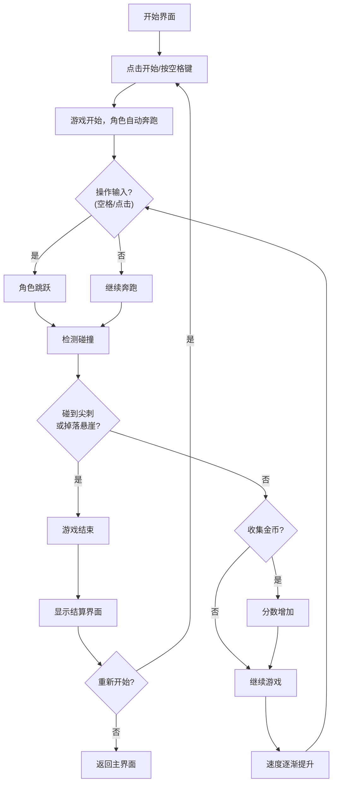

## 1. 产品概述
一款像素风格的无限跑酷平台跳跃游戏，玩家控制角色自动向右奔跑，通过跳跃躲避悬崖和障碍物，收集金币获取高分。
- 核心玩法：简单易上手的一键跳跃操作，适合休闲玩家
- 目标用户：全年龄段休闲游戏玩家，支持PC和移动端

## 2. 核心 Features

### 2.1 用户角色
无用户角色区分，单玩家游戏。

### 2.2 功能模块
1. **游戏主界面**：开始按钮、最高分显示、游戏说明
2. **游戏场景**：无限滚动的平台、障碍物、金币、角色
3. **游戏结束界面**：当前分数、最高分、重新开始按钮

### 2.3 页面详情
| 页面名称 | 模块名称 | 功能描述 |
|---------|---------|---------|
| 游戏主界面 | 开始区域 | 点击开始游戏，显示历史最高分 |
| 游戏主界面 | 说明区域 | 操作说明（空格键/点击跳跃） |
| 游戏场景 | 角色控制 | 自动右跑，跳跃操作，下落物理 |
| 游戏场景 | 平台生成 | 随机生成长度和间距的平台 |
| 游戏场景 | 障碍物系统 | 尖刺（触碰即死）、移动平台 |
| 游戏场景 | 金币系统 | 收集金币增加分数 |
| 游戏场景 | 难度系统 | 速度随分数逐渐提升 |
| 游戏场景 | 分数显示 | 实时显示奔跑距离和金币数 |
| 游戏结束界面 | 结算区域 | 显示本次分数、最高分，重新开始 |

## 3. 核心流程

## 4. 用户界面设计

### 4.1 设计风格
- **主色调**：深蓝色夜空背景 (#0a0a1a)，亮黄色 (#ffd700) 作为强调色
- **辅助色**：平台使用翠绿色 (#2ecc71)，尖刺使用深红色 (#e74c3c)，金币使用金黄色 (#f1c40f)
- **字体**：像素风格字体 "Press Start 2P"，复古游戏感
- **按钮风格**：像素风矩形按钮，悬停时有轻微放大和发光效果
- **整体风格**：复古像素游戏风格，带有霓虹发光效果的现代感

### 4.2 页面设计概览
| 页面名称 | 模块名称 | UI 元素 |
|---------|---------|---------|
| 游戏主界面 | 标题区域 | 大号像素字体标题，霓虹发光效果，居中显示 |
| 游戏主界面 | 开始按钮 | 黄色像素按钮，居中，悬停放大 |
| 游戏主界面 | 分数显示 | 右上角显示最高分，白色像素字体 |
| 游戏场景 | HUD | 顶部显示当前距离和金币数，半透明背景 |
| 游戏场景 | 角色 | 小像素角色，有奔跑、跳跃、下落帧动画 |
| 游戏场景 | 平台 | 翠绿色平台，带有像素纹理 |
| 游戏场景 | 障碍物 | 红色尖刺三角形，移动平台略亮 |
| 游戏场景 | 金币 | 旋转动画的金黄色圆形 |
| 游戏结束界面 | 遮罩层 | 半透明黑色遮罩 |
| 游戏结束界面 | 结算面板 | 白色边框像素面板，显示分数信息 |

### 4.3 响应式
- **桌面端**：使用空格键和鼠标点击控制
- **移动端**：触摸屏幕任意位置跳跃，自适应屏幕尺寸，游戏区域保持16:9比例
- **触控优化**：增加触摸响应区域，减少误触

### 4.4 视觉效果
- **背景**：深蓝色渐变夜空，点缀闪烁星星
- **地面**：滚动的像素地面纹理
- **粒子效果**：收集金币时的金色粒子爆炸
- **动画**：角色奔跑帧动画、金币旋转、星星闪烁、移动平台平滑移动
