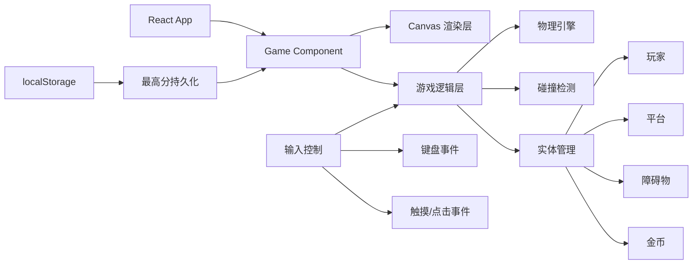

## 1. 架构设计



## 2. 技术描述
- **前端框架**：React@18 + TypeScript
- **构建工具**：Vite@5
- **样式方案**：TailwindCSS@3
- **渲染技术**：HTML5 Canvas 2D
- **状态管理**：React useState/useRef（轻量级游戏状态）
- **数据持久化**：localStorage（存储最高分）
- **动画**：requestAnimationFrame 游戏循环

## 3. 目录结构

```
src/
├── components/
│   ├── Game.tsx          # 主游戏组件
│   ├── StartScreen.tsx   # 开始界面
│   ├── GameOverScreen.tsx # 结束界面
│   └── HUD.tsx           # 游戏内UI
├── game/
│   ├── types.ts          # 类型定义
│   ├── config.ts         # 游戏配置常量
│   ├── engine/
│   │   ├── GameLoop.ts   # 游戏主循环
│   │   ├── Physics.ts    # 物理引擎
│   │   └── Collision.ts  # 碰撞检测
│   └── entities/
│       ├── Player.ts     # 玩家类
│       ├── Platform.ts   # 平台类
│       ├── Spike.ts      # 尖刺类
│       ├── MovingPlatform.ts # 移动平台类
│       └── Coin.ts       # 金币类
├── hooks/
│   └── useGameLoop.ts    # 游戏循环Hook
├── utils/
│   └── storage.ts        # 本地存储工具
├── App.tsx
├── main.tsx
└── index.css
```

## 4. 核心模块说明

### 4.1 游戏循环
- 使用 `requestAnimationFrame` 实现60fps游戏循环
- 固定时间步长更新，确保不同设备上游戏速度一致
- 分离更新逻辑和渲染逻辑

### 4.2 物理引擎
- 重力系统：角色受重力影响下落
- 跳跃系统：固定初速度的跳跃
- 平台吸附：角色落在平台上时速度归零

### 4.3 碰撞检测
- AABB（轴对齐包围盒）碰撞检测
- 玩家与平台：顶部碰撞（站立）
- 玩家与尖刺：任意碰撞即死亡
- 玩家与金币：任意碰撞即收集

### 4.4 平台生成
- 随机生成长度（100-300px）
- 随机间距（50-150px）
- 难度递增：间距随分数增加而增大
- 移动平台：正弦波左右移动

### 4.5 难度系统
- 基础速度：5px/帧
- 速度递增：每100分增加0.5px/帧
- 最大速度：12px/帧

## 5. 类型定义

```typescript
// game/types.ts
export interface Position {
  x: number;
  y: number;
}

export interface Velocity {
  vx: number;
  vy: number;
}

export interface Entity extends Position {
  width: number;
  height: number;
  update: (deltaTime: number, gameSpeed: number) => void;
  render: (ctx: CanvasRenderingContext2D) => void;
}

export interface GameState {
  score: number;
  coins: number;
  highScore: number;
  isPlaying: boolean;
  isGameOver: boolean;
  gameSpeed: number;
}

export type GameAction =
  | { type: 'START' }
  | { type: 'JUMP' }
  | { type: 'GAME_OVER' }
  | { type: 'COLLECT_COIN' }
  | { type: 'RESTART' };
```

## 6. 游戏配置常量

```typescript
// game/config.ts
export const GAME_CONFIG = {
  CANVAS_WIDTH: 800,
  CANVAS_HEIGHT: 450,
  GRAVITY: 0.6,
  JUMP_FORCE: -12,
  BASE_SPEED: 5,
  MAX_SPEED: 12,
  SPEED_INCREMENT: 0.005,
  PLAYER_WIDTH: 32,
  PLAYER_HEIGHT: 48,
  PLATFORM_HEIGHT: 20,
  MIN_PLATFORM_WIDTH: 100,
  MAX_PLATFORM_WIDTH: 300,
  MIN_GAP: 50,
  MAX_GAP: 150,
  COIN_SIZE: 20,
  SPIKE_SIZE: 24,
  GROUND_Y: 380,
} as const;
```

## 7. 路由定义
| 路由 | 用途 |
|-----|------|
| / | 游戏主页面（单页应用，无多路由） |

## 8. 数据存储
- **存储键名**：`platformer_high_score`
- **存储内容**：最高分（number）
- **更新时机**：游戏结束时，若当前分数 > 历史最高分
